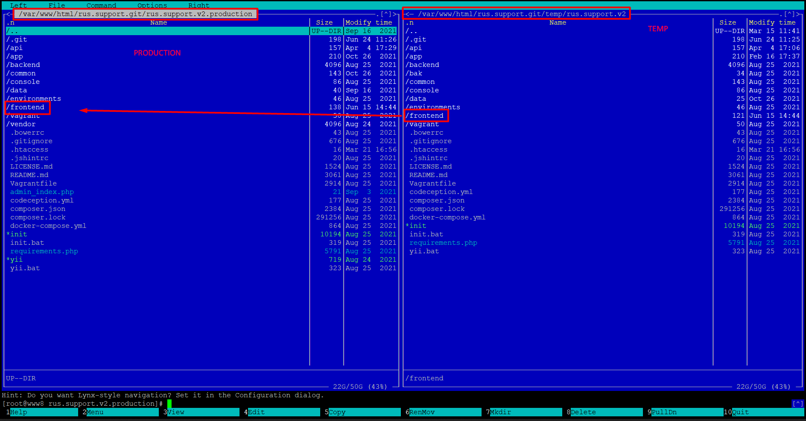

# rus.support
## Репозиторий: [rus.support.v2](http://192.168.15.169:3000/complete/rus.support.v2)

## Ветки:

* develop - ветка для разработки, на ней лежит тестовый сайт [test.rus.support.v2](http://test.rus.support.v2/)
* production - на ней лежит боевой [rus.support](https://rus.support)

## Старый сайт rus.support
На старом сайте в данный момент работает только оплата по адресу [payments.rus.support](https://payments.rus.support/) и проверка статуса заявки [payments.rus.support/case-status](https://payments.rus.support/case-status)

Репозиторий: [old.rus.support](http://192.168.15.169:3000/complete/rus.support)  
Изменения по кассе и по заявкам нужно производить именно в этом репо.

## Папки на сервере:

Главная /rus.support.git в ней лежат еще три папки
* rus.support.develop.production - старый сайт rus.support (касса, проверка статуса заявки)
* rus.support.v2.production - боевой сайт rus.support
* temp - бэкапы + папка rus.support.v2 в которой мы делаем `git pull`

Для того, чтобы обновить боевой сайт rus.support нужно:

1. Клонировать конкретную ветку - **production** рядом со своим локальным проектом командой `git clone --single-branch -b production http://192.168.15.169:3000/complete/rus.support.v2.git`
2. Копировать папку **frontend** своего локального проекта в папку **frontend** клонированного с ветки **production** проекта
3. Открыть клонированый **production** проект, закомитить и запушить изменения в ветку **production**
4. Заходим на сервер через Putty
5. На сервере идем в папку `/rus.support.git/temp/rus.support.v2`
6. Сворачиваем панель `ctrl + o`, вводим команду `git pull`
7. Возвращаемся в панель. В левой части панели открываем наш **production** проект,
который находится в папке `rus.support.v2.production`. Соответсвенно в левой части панели у нас открыт **production**, а в правой проект, который лежит в папке `/rus.support.git/temp/rus.support.v2`
8. Копируем папку **frontend** из правой части в левую часть через **F5**
    Так мы обновили проект на боевом сервере.